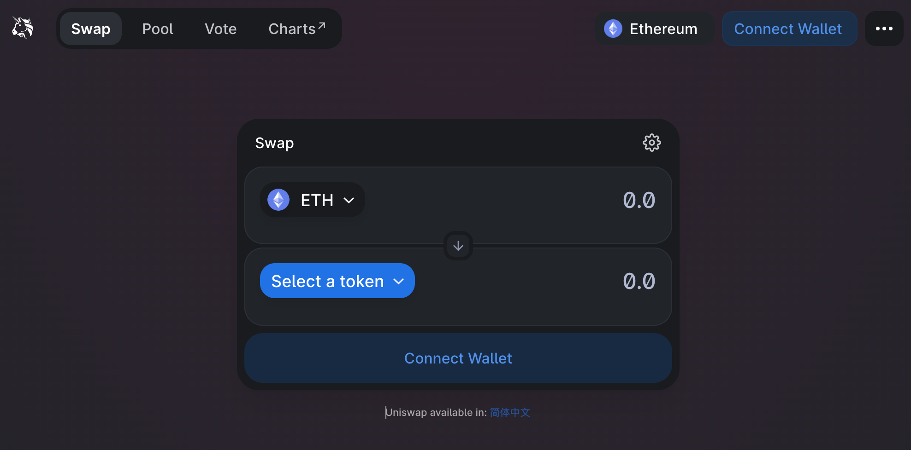
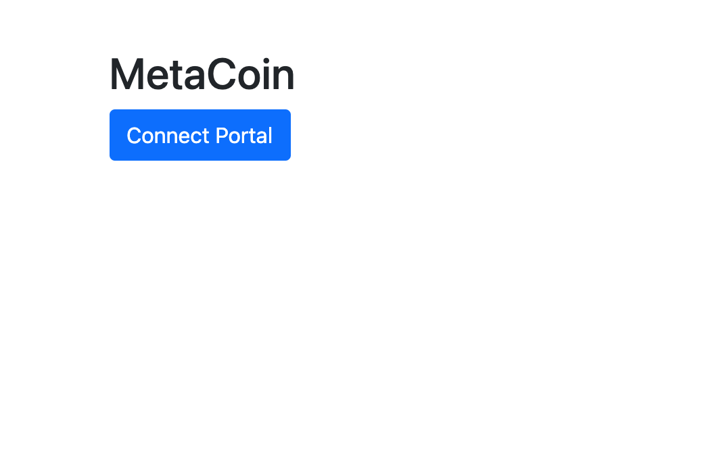
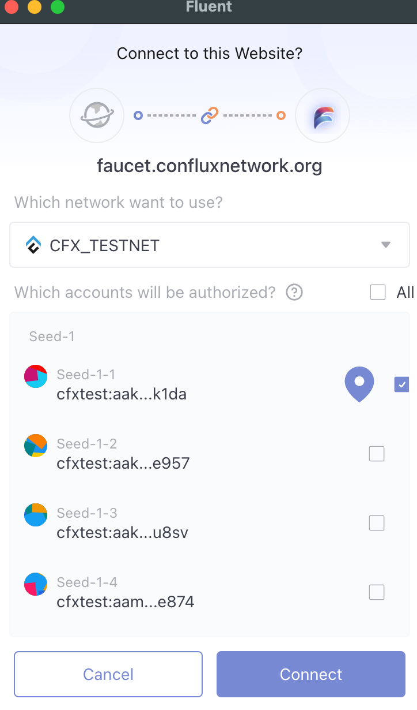
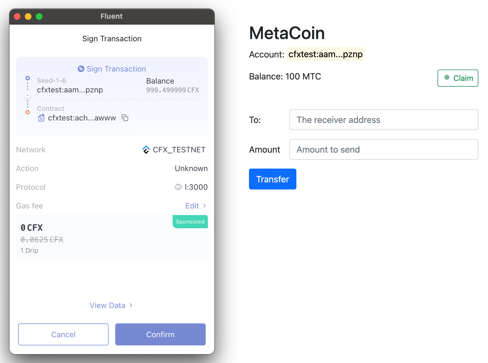
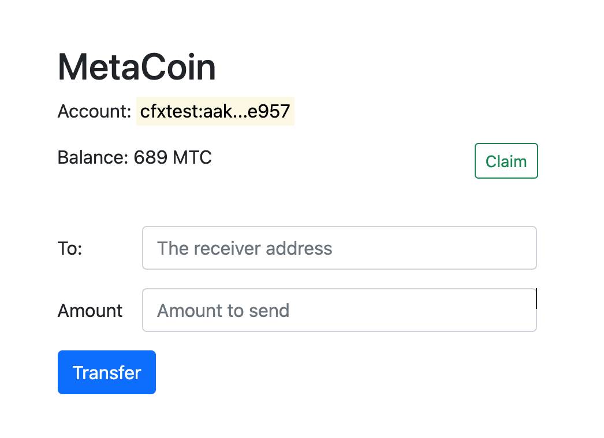

# Development of MetaCoin Dapp

Coin or Token is the most typical application of smart contracts. Additionally, smart contracts can implement a wide range of functions, such as NFTs, swaps, lendings, etc. Interaction with smart contracts is often provided through a web page, where the user can interact with the contract through a browser extension wallet. The image below shows the interaction interface of the famous DEX Uniswap. It provides the exchange function between main tokens.



## Principle

As a matter of fact, a DApp provides a visual UI that makes it easier for normal users to interact with smart contracts. We have mentioned the two types of interaction earlier: querying contract information and updating contract status. Updating the contract status requires sending a transaction, so it involves interaction with the wallet. Currently, all main public chains have browser extension wallets, whose core function is to manage users' private keys and provide the function of sending transactions. For example, Metamask, the most famous wallet of Ethereum, injects an API into the page, allowing the page to make calls to the extension wallet and send transactions (requiring user authorization), thus enabling interaction with smart contracts.

## MetaCoin Dapp

Now let's develop a simple web page that implements these functions of interacting with the MetaCoin smart contract developed in the previous sections:

* Check the user's `MetaCoin` balance
* Claim 100 MetaCoin by the `Claim` button
* Allow the user to initiate a MetaCoin `transfer` by entering the target address and the amount.

You can also visit this page directly to [experience the MetaCoin DApp](https://conflux-fans.github.io/conflux-dapp-tutorial/index.html)

We will use the following technologies to implement this page:

* Basic web technologies: HTML, CSS, JS
* Bootstrap UI framework
* js-conflux-sdk: for interacting with smart contract methods
* Fluent(API): calls up the Fluent window and sends transactions
* MetaCoin contract `address` and `ABI`

### Page Initialization

#### Introducing js-conflux-sdk

First, we need to import some CSS and JS libs. For simplicity, we use the links provided by `jsdelivr`

```html
<script type="text/javascript" src="https://cdn.jsdelivr.net/npm/js-conflux-sdk/dist/js-conflux-sdk.umd.min.js"></script>
<script src="./metaCoinAbi.js"></script>
<script src="./dapp.js"></script>
```

The first line is the front-end library code for js-conflux-sdk. The other two lines are the ABI and interaction logic code for the DApp. The DApp also uses a few third-party CSS and JS libraries. See the `index.html` source code for details.

#### Instantiating Conflux and the MetaCoin contract 

Once the basic library has been introduced, the first thing we need to do is to create instances of `Conflux` and `Contract`. The Conflux instance provides methods for calling the Fullnode RPC. The Contract instance provides methods for interacting with the MetaCoin contract. These two class instances are required for the interaction between DApp and the contract.

```js
const confluxClient = new TreeGraph.Conflux({
  url: 'https://test.confluxrpc.com',
  logger: console,
  networkId: 1,
});

const metaCoinAddress = 'cfxtest:achmuxabbazzzud7aexun00s5gsgmvgs82agjrawww';
const metaCoinContract = confluxClient.Contract({
  address: metaCoinAddress,
  abi: metaCoinAbi,
});
```

#### Detect Fluent & Setup the client provider

As the DApp needs to send transactions by the wallet extension, users should check if the wallet extension is already installed in the user's browser once the DApp is loaded. Otherwise, the DApp will not work.

The `conflux` object injected into the browser by the wallet plugin is then set as the provider for confluxClient. `conflux` instances provide the [same RPC as Fullnode](https://conflux-portal-docs.confluxnetwork.org/docs/portal/API_Reference/json_rpc_api). So users can replace the SDK's internal RPC-method-calling module (provider). And it also supports signing transaction sent through the cfx_sendTransaction method using the private key managed by the wallet. This process enables transactions to be sent.

```js
// check whether fluent is installed through window.conflux
if(!window.conflux) {
  alert('Please install Fluent wallet');
  return;
}
// use fluent export conflux as SDK client instance's provider
// to use fluent account's private key sign transaction
confluxClient.provider = window.conflux;
```

### Page Logic

#### Request a Fluent Account



The first step of interacting with the DApp is to obtain the account address by connecting to the wallet account. This account will be used for subsequent user contract information queries and transaction sending.

It is recommended to place the account connection in one of the event response methods (e.g. the account can be requested in the callback of the Connect Wallet button's click event). It is not recommended to connect immediately after the page loads.

```js
const _accounts = await conflux.send('cfx_requestAccounts');
if (_accounts.length == 0) {
  alert('Request accounts failed');
  return;
}
const currentAccount = _accounts[0];
/*
[
  "cfxtest:aak2rra2njvd77ezwjvx04kkds9fzagfe6d5r8e957"
]
*/
```

DApp requests to connect with the Fluent account



#### Check the MetaCoin balance

It is simple to query the MetaCoin balance of the connected account. Just call the `balanceOf` method of the contract instance `metaCoinContract`. The parameter is the address of the account obtained.

```js
const balance = await metaCoinContract.balanceOf(currentAccount);
```

#### Claim

The example provides a `faucet` method that allows anyone to receive `100` MetaCoin at a time. Calling this method requires sending a transaction to receive the tokens successfully.

The wallet extension provides a `cfx_sendTransaction` method that can be used to send transactions. The transactions need to specify the `from` parameter, which is the sender's address. Then, the wallet will pop up a window to request the user to authorize signing the transaction. The transaction will be sent once it is signed by the private key of that address.

```js
const params = [
  {
    from: "CFX:TYPE.USER:AANA7DS0DVSXFTYANC727SNUU6HUSJ3VMYC3F1AY93",
    to: "CFX:TYPE.USER:AAMG7DS0TVSXFTYANC727SNUU6HUSKCFP64HY12RKN",
    gas: "0x76c0", // 30400
    gasPrice: "0x9184e72a000", // 10000000000000
    value: "0x9184e72a", // 2441406250
    data: "0xd46e8dd67c5d32be8d46e8dd67c5d32be8058bb8eb970870f072445675058bb8eb970870f072445675",
  },
]

conflux
  .send("cfx_sendTransaction", params)
  .then(function (result) {
    // The result varies by method, per the JSON RPC API.
    // For example, this method will return a transaction hash on success.
  })
  .catch(function (error) {
    // Like a typical promise, returns an error on rejection.
  })
```



A much easier way is to set the `conflux` instance provided by Fluent as the provider of the SDK Conflux instance. Then you can use the transaction sending method of the SDK to send the transaction.

```js
confluxClient.provider = window.conflux;
await confluxClient.cfx.sendTransaction({
  from: currentAccount,
  to: metaCoinAddress,
  data: '0xxxxxx'  // the abi encoded data
});
```

Also, you can just call the contract method directly and send the transaction while interacting with the contract method. The point is to set the "from" of the transaction to the current account obtained from Fluent.

```js
const txHash = await metaCoinContract.faucet().sendTransaction({
  from: currentAccount,
});
```

#### Transfer

Similar to Claim, initiating a MetaCoin transfer, you need to invoke the transfer method of the contract by sending a transaction. The method parameters are the receiving account and the transfer amount entered by the user.

```js
const hash = await metaCoinContract.transfer(to, parseInt(amount)).sendTransaction({
  from: currentAccount,
});
```



## Reference

The source code of MetaCoin DApp is located under `/docs` directory

* [Fluent Document](https://fluent-wallet.zendesk.com/hc/en-001)
* [Portal Document](http://conflux-portal-docs.confluxnetwork.org/docs/portal/introduction/)