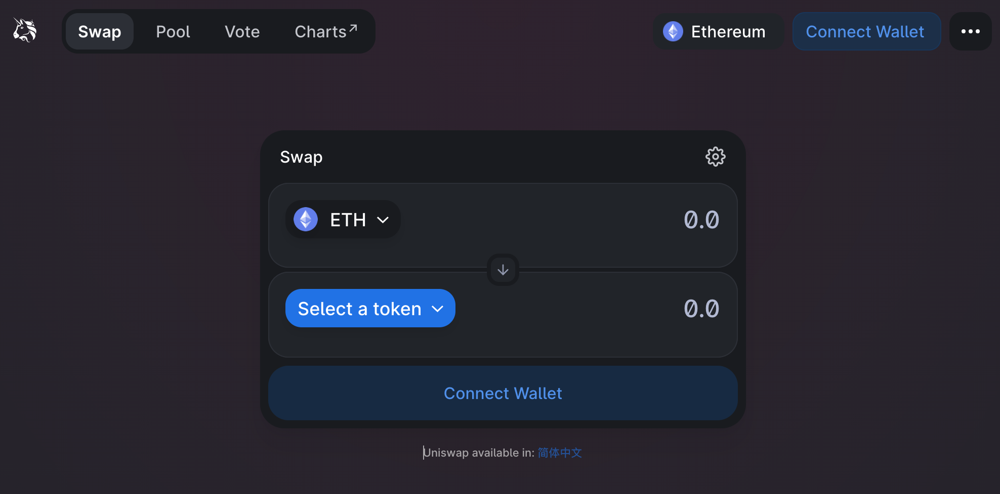
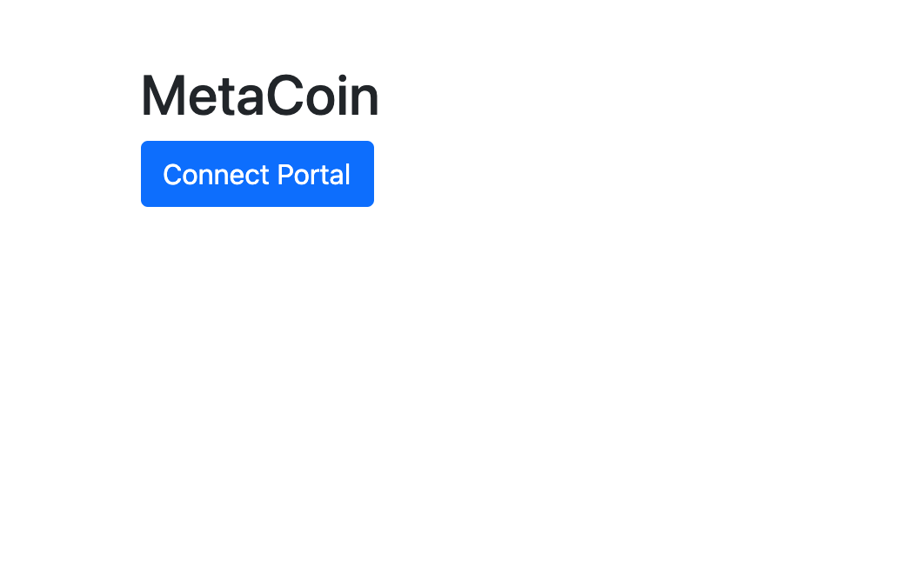
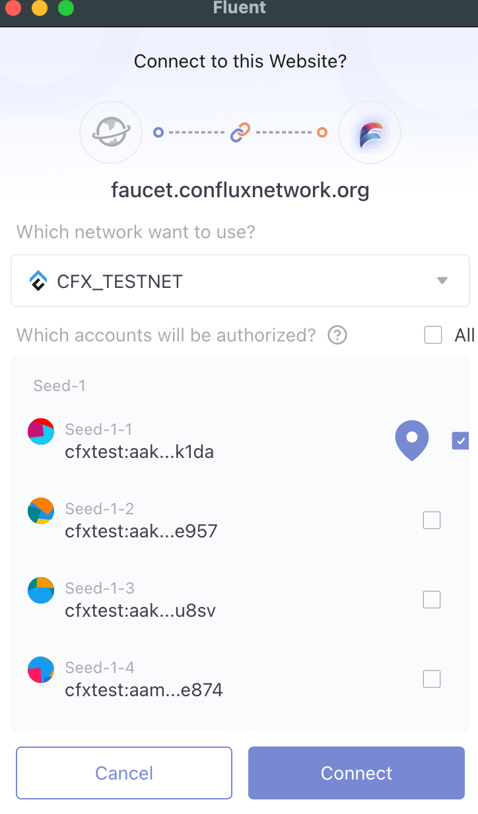
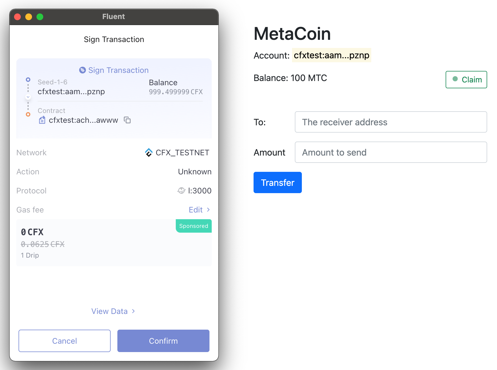
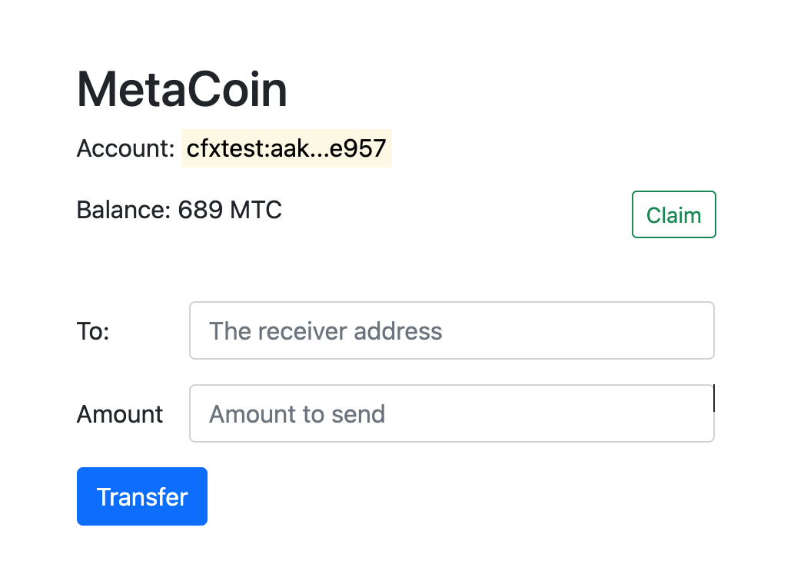

# MetaCoin Dapp 开发

Coin 或 Token 是智能合约最典型的应用，除此之外智能合约还能实现多种多样的功能 NFT，Swap，借贷功能等等。同智能合约的交互往往通过一个 Web 页面提供，用户通过浏览器插件钱包可完成与合约的各种交互。下图就是大名鼎鼎的 Uniswap 的交互界面，通过它可以实现主流两种代币的交换。



## 原理

本质上 Dapp 提供了可视化的 UI，能够让普通用户更简单的与智能合约进行交互，所谓的交互即是之前提到的两种：查询合约信息；更新合约状态。合约状态的的更新需要发送交易，因此会涉及到与钱包的交互。当前主流公链都有浏览器插件钱包，它们最核心的功能即是管理用户的私钥，并提供发送交易的功能。比如以太坊最知名的小狐狸钱包(Metamask)。钱包会向页面注入 API，允许网页调起插件钱包，发送交易(需要用户授权)，从而实现与智能合约交互。

## MetaCoin Dapp

现在我们来开发一个简单的网页实现与上几节开发的 MetaCoin 智能合约交互的功能，主要包含以下几个功能:

* 查询用户的 MetaCoin 余额
* 通过 `Claim` 按钮领取 100 MetaCoin
* 允许用户输入目标地址和金额，发起 MetaCoin `转账`

实现这个页面我们会用到以下技术：

* 基本的网页技术：HTML, CSS, JS
* Bootstrap UI 框架
* js-conflux-sdk: 用于与智能合约方法交互
* Fluent(API): 调起 Fluent 窗口，发送交易
* MetaCoin 合约 `地址`和 `ABI`

### 页面初始化

#### 引入 js-conflux-sdk

首先我们需要引入用到的 CSS 和 JS lib，简单起见我们直接使用了 `jsdelivr` 提供的链接

```html
<script type="text/javascript" src="https://cdn.jsdelivr.net/npm/js-conflux-sdk/dist/js-conflux-sdk.umd.min.js"></script>
<script src="./metaCoinAbi.js"></script>
<script src="./dapp.js"></script>
```

第一个是 js-conflux-sdk 的前端库代码，后两个为 dapp 的 ABI 和 交互逻辑代码。本 Dapp 还是用了几个三方 CSS 和 JS 库，详情参看 `index.html` 源码。

#### 创建 Conflux 和 MetaCoin 合约实例

基础库引入好之后，我们首先要做的是创建 `Conflux` 和 `Contract` 实例, 前者提供了调用 Fullnode RPC 的方法，后者提供了与 MetaCoin 合约交互的方法。Dapp 与合约的交互需要用到这两个类实例

```js
const confluxClient = new TreeGraph.Conflux({
  url: 'https://test.confluxrpc.com',
  logger: console,
  networkId: 1,
});

const metaCoinAddress = 'cfxtest:achmuxabbazzzud7aexun00s5gsgmvgs82agjrawww';
const metaCoinContract = confluxClient.Contract({
  address: metaCoinAddress,
  abi: metaCoinAbi,
});
```

#### 检测 Fluent & 设置 client provider

因为 Dapp 需要通过钱包插件发送交易，所以 Dapp 加载之后，需要检测用户的浏览器是否已经安装了钱包插件，若没有安装 Dapp 将无法使用。

然后将钱包插件注入到浏览器的 `conflux` 对象设置为 confluxClient 的 provider。`conflux` 实例提供了与 Fullnode  [一样的 RPC ](https://conflux-portal-docs.confluxnetwork.org/docs/portal/API_Reference/json_rpc_api) 因此可以替换掉 SDK 内部的 RPC 方法调用模块 (provider) 并且支持使用其管理的私钥对 `cfx_sendTransaction` 方法发送的`交易`进行签名，从而实现交易的发送。

```js
// check whether fluent is installed through window.conflux
if(!window.conflux) {
  alert('Please install Fluent wallet');
  return;
}
// use fluent export conflux as SDK client instance's provider
// to use fluent account's private key sign transaction
confluxClient.provider = window.conflux;
```

### 页面逻辑

#### 请求 Fluent 账户



想要同 Dapp 进行交互，第一步需要连接钱包账户获取账户地址。该账户会用于后续的用户合约信息查询和交易发送。

建议账户连接操作放到某个事件响应方法中(比如可以在 Connect Wallet 按钮的点击事件回调中请求账户)，不建议在页面加载后立刻连接。

```js
const _accounts = await conflux.send('cfx_requestAccounts');
if (_accounts.length == 0) {
  alert('Request accounts failed');
  return;
}
const currentAccount = _accounts[0];
/*
[
  "cfxtest:aak2rra2njvd77ezwjvx04kkds9fzagfe6d5r8e957"
]
*/
```

Dapp 请求连接 Fluent 账户



#### 查询 MetaCoin 余额

查询当前连接账户的 MetaCoin 余额比较简单，直接调用合约实例 `metaCoinContract` 的  `balanceOf` 方法即可。参数使用获取的账户地址

```js
const balance = await metaCoinContract.balanceOf(currentAccount);
```

#### Claim

示例合约提供了一个 `faucet` 方法，允许任何人一次领取 `100` 的 MetaCoin，调用该方法需要发起交易，才能成功领取到代币。

钱包插件提供的 `cfx_sendTransaction` 方法，可用于发送交易，发送的交易需要指定 `from` 参数即发送方地址，钱包会弹出窗口申请用户授权签名交易，用户同意后使用该地址的私钥签名交易，并发送出去。

```js
const params = [
  {
    from: "CFX:TYPE.USER:AANA7DS0DVSXFTYANC727SNUU6HUSJ3VMYC3F1AY93",
    to: "CFX:TYPE.USER:AAMG7DS0TVSXFTYANC727SNUU6HUSKCFP64HY12RKN",
    gas: "0x76c0", // 30400
    gasPrice: "0x9184e72a000", // 10000000000000
    value: "0x9184e72a", // 2441406250
    data: "0xd46e8dd67c5d32be8d46e8dd67c5d32be8058bb8eb970870f072445675058bb8eb970870f072445675",
  },
]

conflux
  .send("cfx_sendTransaction", params)
  .then(function (result) {
    // The result varies by method, per the JSON RPC API.
    // For example, this method will return a transaction hash on success.
  })
  .catch(function (error) {
    // Like a typical promise, returns an error on rejection.
  })
```



更简单的一种方式是将 Fluent 提供的 `conflux` 实例，设置为 SDK `Conflux` 实例的 provider，然后可以使用 SDK 的交易发送方法来发送交易：

```js
confluxClient.provider = window.conflux;
await confluxClient.cfx.sendTransaction({
  from: currentAccount,
  to: metaCoinAddress,
  data: '0xxxxxx'  // the abi encoded data
});
```

同样与合约方法交互，也可以直接调用合约方法，并发送交易即可。重点是把交易的 from 设置为从 Fluent 获取的当前账户。

```js
const txHash = await metaCoinContract.faucet().sendTransaction({
  from: currentAccount,
});
```

#### 转账

发起 MetaCoin 转账，与 Claim 类似，只要以发送交易的方式调用合约的 `transfer` 方法即可，方法参数为用户输入的接受账户和转账金额。

```js
const hash = await metaCoinContract.transfer(to, parseInt(amount)).sendTransaction({
  from: currentAccount,
});
```



## 参考

* [Fluent 文档](https://fluent-wallet.zendesk.com/hc/en-001/sections/4410740784411-Developer-Documentation)
* [Portal 文档](http://conflux-portal-docs.confluxnetwork.org/docs/portal/introduction/)